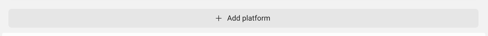
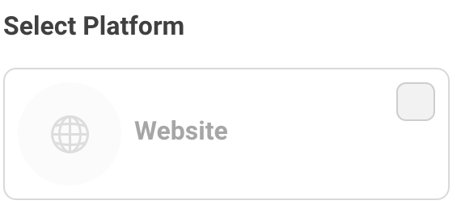
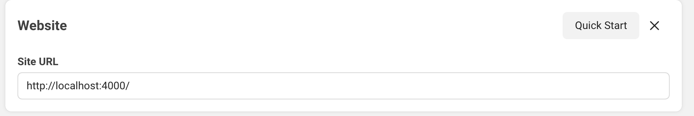

<div align="center">

# `elixir-auth-facebook`


_Easily_ add `Facebook` login to your `Elixir` / `Phoenix` Apps
with step-by-step **_detailed_ documentation**.

</div>

## Why?

Facebook authentication is used **_everywhere_**!
More than tens of millions of people use it everyday.
Facebook Login can be used to authenticate people without planning to access their data.

We wanted to create a reusable `Elixir` package
with beginner-friendly instructions and readable code.

## What?

A simple and easy-to-use `Elixir` package that gives you
**Facebook `OAuth` Authentication** for your **web app**
in a few steps with a minimal API.

❗️ If you target Android or IOS, use the SDK.

> If you're new to `Elixir`,
> please see: [dwyl/**learn-elixir**](https://github.com/dwyl/learn-hapi)

## How?

These instructions will guide you through setup in 5 simple steps.
By the end you will have **login with `Facebook`** in your **Web** App.

> **Note**: if you get stuck,
> please let us know by opening an issue!

## Step 1: Create quickly a Facebook app 🆕

You need a Facebook developer account. It is free.
You will create an app and get the **credentials** in minutes.

### Step 1.1 Create or use a developer account from your personal Facebook account

Go to <https://developers.facebook.com/apps/>

...after logging in to your facebook account, you can 'Register Now' for a developer account.

### Step 1.2 Create an App

- select the app type: **"consumer"**
- provide basic info, such as:

  - app name (can be changed)
  - contact name


### Step 1.3 Get and save your credentials

Once you are done, you arrive to the Dasboard.
Select **settings**, then **basic**.


You will find your **credentials** there.
Copy the App ID and the App Secret into your `.env` file which is "git-ignored".

```env
# .env
export FACEBOOK_APP_ID=xxxxx
export FACEBOOK_APP_SECRET=xxxx
```

### Step 1.4 Specify the base redirect URI

Lastly, you need to set the callback **base URL**.
Your app won't work if a wrong or incomplete base URL is set **AND** must correspond

- At the bottom of the form, click on **+ Add platform**, and choose **Website**



- click on **Web** in the "Select Platform" modal



- a new input will appear: fill the **Site URL** with:
  <http://localhost:4000> or <https://localhost>

> **Note1**: this is the base redirect URI, so it has to be an _absolute_ URI, not only the domain. Make sure you include the `http://` prefix or `https://`.

**Why HTTPS? And how?**
In dev mode, you can use <http://localhost:4000>.
However, when the user denies the dialog, you get a **routing error**. It expects a HTTPS routing like in production.
For this reason, even in dev mode,you can put a reverse-proxy in front of your app and use <https://localhost> instead.
An easy solution is to use [**Caddyserver**](https://caddyserver.com/). Check the SDK page for details.



You can pass the key `HTTPS="TRUE"` in your `.env` file
or pass it the configuration file (`/config.config.exs`):

For example, if you decided to simulate SSL with Caddyserver, you set:

```elixir
config :elixir_auth_facebook,
  fb_app_id: System.get_env("FACEBOOK_APP_ID"),
  fb_app_secret: System.get_env("FACEBOOK_APP_SECRET")
  https: "true"
```

## Step 2: use the ElixirAuthFacebook module

You want to display a **login link** in one of your pages.
It brings the user to the Facebook dialog form.

### Add a "Login with Facebook" link in your template ✨

Suppose you render the file `/lib/app_web/templates/page/index.html.heex`.
Add the code below:

```html
<a class="your-classes" href="{@oauth_facebook_url}">
  
</a>
```

### Modify the template controller

This `href` address is an "assign" `@oauth_facebook_url`.
This is build in the controller that renders your template.
The file is: `lib/app_Web/controllers/page_controller/ex`.

Add the following code:

```elixir
defmodule AppWeb.PageController do
  use Phoenix.Controler

  def index(conn, _p) do
    oauth_facebook_url =
      ElixirAuthFacebook.generate_oauth_url(conn)

    render(
      conn,
      "index.html",
      oauth_facebook_url: oauth_facebook_url
   )
  end
end
```

### Create the `auth/facebook/callback` endpoint 📍

Once the user has filled the dialog form, he will be redirected.

Add this line to set the redirection in the router.

```elixir
#MyAppWeb.Router

scope "/", MyAppWeb do
  pipe_through :browser
  get "/auth/facebook/callback",
    FacebookAuthController, :login
end
```

> **Note**: this is the same

### Create a `FacebookAuthController` 🆕

We need a controller to respond to the endpoint action.

```elixir
defmodule AppWeb.FacebookController do
use MyAppWeb, :controller

def login(conn, _,_) do

  with {:ok, profile} <- ElixirAuthFacebook.handle_callback(conn, params) do
      conn
      |> put_session(:profile, profile)
      |> put_view(AppWeb.WelcomeView)
      |> render(:welcome, profile, profile)
    end
end
```

It eventually sends back on object which identifies the user. 🚀

```elixir
%{
  access_token: "EAAFNaUA6VI8BAPkCCVV6q0U0tf7...",
  email: "xxxxx",
  fb_id: "10223726006128074",
  name: "Harry Potter",
  picture: %{
    "data" => %{
      "height" => 50,
      "is_silhouette" => false,
      "url" => "xxxxx",
      "width" => 50
    }
  }
}
```

> **Note**: the user receives a long term "access_token". The app could interact with the Facebook eco-system on behalf of the user.
> These tokens should be saved in the database, appended to a session.

> If you simply need to authenticate a user, these tokens are useless.

### _Optional_:

To handle errors in the dialog server/facebook, we can use an `action_fallback(AppWeb.LoginError)` in the controller `FacebookAuthController`, just at hte beginning.
You will capture the errors which are not handled at the moment.

An example:

```elixir
defmodule AppWeb.LoginErrorController do
  use Phoenix.Controller

  def call(conn, {:error, message}) do
    conn
    |> put_flash(:error, inspect(message))
    |> put_view(AppWeb.PageView)
    |> redirect(to: AppWeb.Router.Helpers.page_path(conn, :index))
    |> halt()
  end
end
```

You want overwrite it, if you don't want to render flash for example.

### Notes 📝

All the flow to build the Login flow can be found here:
<https://developers.facebook.com/docs/facebook-login/guides/advanced/manual-flow>

#### Meta / Privacy Concerns? 🔐

No cookie is set. It just provides a user authentication.

You have the tokens to do more,❗️ but need an [opinion(?) on Meta](https://archive.ph/epKXZ).
Use this package as a last resort if you have no other option!

#### Data deletion?

If you want to use the package to access Metas' eco-system, then you need to provide [a data deletion option](https://developers.facebook.com/docs/facebook-login/overview)

❗️ To be compliant with GDPR guidelines, you must provide the following:

- A way in your app for users to request their data be deleted
- A contact email address that people can use to reach you to request their data be deleted
- An implementation of the data deletion callback
