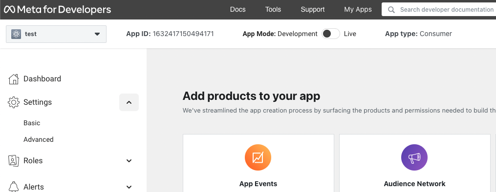
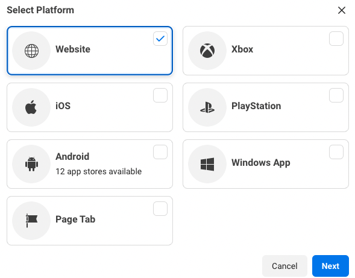
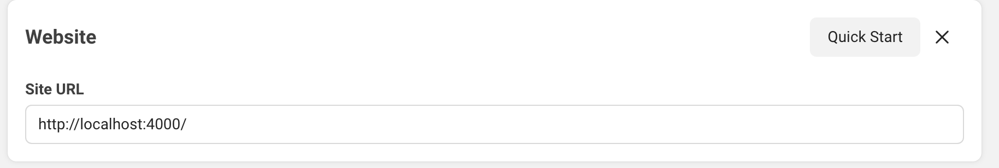

<div align="center">

# `elixir-auth-facebook`

Old image that was used.


Official logo below


_Easily_ add `Facebook` login to your `Elixir` / `Phoenix` Apps
with step-by-step **_detailed_ documentation**.

</div>

## Why?

Facebook authentication is used **_everywhere_**!
More than tens of millions of people use it everyday.
Facebook Login can be used to authenticate people without planning to access their data.

We wanted to create a reusable `Elixir` package
with beginner-friendly instructions and readable code.

## What?

A simple and easy-to-use `Elixir` package that gives you
**Facebook `OAuth` Authentication** for your **web app**
in a few steps with a minimal API.

❗️ If you target Android or IOS, use the SDK.

> If you're new to `Elixir`,
> please see: [dwyl/**learn-elixir**](https://github.com/dwyl/learn-hapi)

## How?

These instructions will guide you through setup in 5 simple steps.
By the end you will have **login with `Facebook`** in your **Web** App.

> **Note**: if you get stuck,
> please let us know by opening an issue!

## Step 1: Create a Facebook app 🆕

You need to have a Facebook developer account.
It is free. You just use your Facebook account.
You will create an app and get the **credentials** in minutes.

### Step 1.1 Create or use a developer account from your personal Facebook account

Go to <https://developers.facebook.com/apps/>

...after logging in to your facebook account, you can 'Register Now' for a developer account.

### Step 1.2 Create an App

- select the app type: **"consumer"**
- provide basic info, such as:

  - app name (can be changed)
  - contact name


### Step 1.3 Your credentials

Once you are done, you arrive to the Dasboard.
Select **settings**, then **basic**.



You will find your **credentials** there.
Copy the App ID and the App Secret into your `.env` file.

```env
# .env
export FACEBOOK_APP_ID=xxxxx
export FACEBOOK_APP_SECRET=xxxx
```

### Step 1.4 Specify the base redirect URI

Lastly, you need to set the callback **base URL**.
Your app won't work if a wrong or incomplete base URL is set.

- At the bottom of the form, click on **+ Add platform**


- click on **Web** in the "Select Platform" modal



- a new input will appear: fill the **Site URL** with:
  <http://localhost:4000>



**Note**: this is the base redirect URI, so it has to be an _absolute_ URI, not only the domain. Make sure you include the `http://` prefix.

## Step 2: use the ElixirAuthFacebook module

You want to display a **login** link in one of your pages.
It will be an external navigation to the Facebook login dialog form.

### Add a login link in your template ✨

```html
<a class="your-classes" href="{@oauth_facebook_url}">
  
</a>
```

### Modify the template controller

We know need to generate this "href" address and set it in the assign `@oauth_facebook_url`.
This is done in the controller.
You can add this code for your template.

```elixir
use MyAppWeb, :controller

def index(conn, _p) do
  oauth_facebook_url =
    ElixirAuthFacebook.generate_oauth_url(conn)

  render(
    conn,
    "index.html",
    oauth_facebook_url: oauth_facebook_url
  )
end
```

### Create the `auth/facebook/callback` endpoint 📍

Once the user has filled the dialog form, he will be redirected.

Add this line to set the redirection in the router.

```elixir
#MyAppWeb.Router

scope "/", MyAppWeb do
  pipe_through :browser
  get "/auth/facebook/callback",
    FacebookAuthController, :login
end
```

### Create a `FacebookAuthController`

We finally need a controller to respond to the endpoint:

```elixir
# defmodule MyAppWeb.FacebookController do
use MyAppWeb, :controller

def login(conn, _,_) do

  {:ok, profile} =
    ElixirAuthFacebook.handle_callback(conn, params)

  #[... process the profile for the next render..]
end
```

It eventually sends back the object below which identifies the user :eyes:

```elixir
%{
  access_token: "EAAFNaUA6VI8BAPkCCVV6q0U0tf7...",
  email: "xxxxx",
  fb_id: "10223726006128074",
  name: "Harry Potter",
  picture: %{
    "data" => %{
      "height" => 50,
      "is_silhouette" => false,
      "url" => "xxxxx",
      "width" => 50
    }
  }
}
```

You receive a long term "access_token".
The app can interact with the Facebook eco-system on behalf of the user with the token. These tokens should be saved in the database, appended to a session. If you do so, have a look at the data deletion policy at the end.

> If you simply need to authenticate a user, this token is useless and everything is fine.

### Create an extra token

In your terminal, type `mix gen.secret 32`

This code will be called `FACEBOOK_STATE`
Copy it into your `.env` file as below:

```env
# .env
export FACEBOOK_APP_ID=1234...
export FACEBOOK_APP_SECRET=A1B2C3...
export FACEBOOK_STATE= <--- this new code
```

Done! :rocket:

### A note on SSL certificate :lock:

**TL;DR**: if you use this module, you don't need a reverse-proxy in DEV mode.

However, if the user denies the login in this mode, then the app stops since it wants to reach an HTTPS endpoint. This is the only limitation.

But if you want to use the SDK, then you need it :hushed:

The SDK wants HTTPS, so you need to **reverse-proxy** your app (_and also enable the JSSDK in Facebook's app settings_). This means you have a piece of software between the web and your app that intercepts the traffic and forwards the traffic back to the app. A reverse-proxy can present an SSL certificate to enable the HTTPS protocole.
With this, your app can be reached at https://localhost.
Of course, your app is still running as normal behind, on http://localhost:4000. These modes are differentiated by the port.

#### How HTTPS :fearful: ?

It's a piece of cake with **[Caddyserver](https://caddyserver.com/docs/)**.
Install it in minutes, create a file named `CaddyFile` at the root, paste the code below, and type `caddy run` in a different terminal, and that's it :tada:

```
localhost:443 {
	handle {
		reverse_proxy 127.0.0.1:4000
	}
}
```

### Notes 📝

All the flow to build the Login flow can be found here:
<https://developers.facebook.com/docs/facebook-login/guides/advanced/manual-flow>

#### Meta / Privacy Concerns? 🔐

No cookie is set. It just provides a user authentication.

You have the tokens to do more,❗️ but need an [opinion(?) on Meta](https://archive.ph/epKXZ).
Use this package as a last resort if you have no other option!

#### Data deletion?

If you want to use the package to access Metas' eco-system, then you need to provide [a data deletion option](https://developers.facebook.com/docs/facebook-login/overview)

❗️ To be compliant with GDPR guidelines, you must provide the following:

- A way in your app for users to request their data be deleted
- A contact email address that people can use to reach you to request their data be deleted
- An implementation of the data deletion callback
