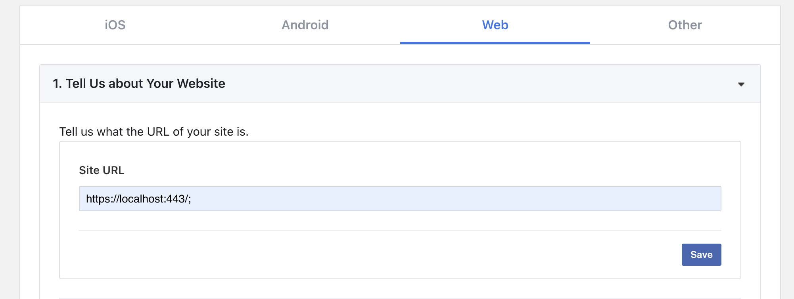
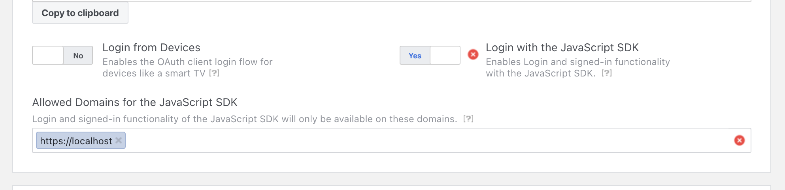
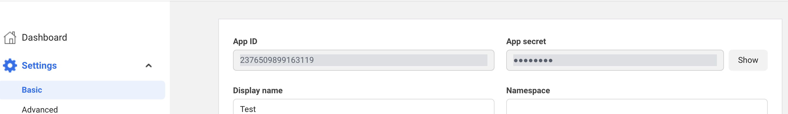

<div align="center">

# `elixir-auth-facebook-SDK`


A guide to _easily_ add the `Facebook SDK` login
to your `Elixir` / `Phoenix` Apps
with step-by-step **_detailed_ documentation**.

</div>

## Why?

Facebook authentication is used **_everywhere_**!
More than tens of millions of people use it everyday.
Facebook Login can be used to authenticate people without planning to access their data.

## What?

This is a guide on how to implement easily the facebook SDK.

It gives you **Facebook `OAuth` Authentication** for your **app** in a few steps with a minimal API.

> **Note**: you will need to simulate SSL, so a solution is proposed using CaddyServer

## How?

These instructions will guide you through setup in 7 steps:

- register your app in Facebooks' dev portal (easy),
- save your credentials in `.env` file,
- create the login button in a template,
- **paste** the Javascript module into your code,
- create a new endpoint in your `router.ex`,
- create a controller for the callback
- setup an SSL server to enable HTTPS (easy)

By the end you will have **login with `Facebook`** in your App.

## Step 1: Register a 🆕 app

### Create an App

You firstly need to have a Facebook developer account.
It is free. You get it from your personal Facebook account.

<https://developers.facebook.com/apps/>

We follow the documentation. The process is fairly easy.

<https://developers.facebook.com/docs/development/create-an-app/>

Select the app type **consumer**, and provide basic info, such as app name (can be changed) and contact name

Once you are done, you arrive to the Dasboard.

Click on **"Facebook Login"**, then **Web**


### Define the **site URL**

❗️ we will use **https**, even in dev mode.



### Enable JavaScript SDK and allowed domain

From the dashboard, navigate to "Facebook Login/Settings"

Turn "Yes" on, and set the domain



### Your credentials

You will find your **credentials** under "Settings/Basic"



Copy the App ID and the App Secret into your `.env` file (do **NOT** commit).

```env
# .env
export FACEBOOK_APP_ID=xxxxx
export FACEBOOK_APP_SECRET=xxxx
```

Lastly, in the same page, complete the Data Protection Officer contact information (otherwise you get an error).

## Step 2: The code

> **Note**: we will need HTTPS to remove the error.

You want to display a **login button** in a template.

There is a listener on the click event in the `facebook.js` module.
It triggers the Facebook dialog form.

Once you are connected, we send the users' data to the server.
We therefor define an endpoint, and a handler in a controller.

### Add the login link in your template ✨

- add the code below in a template to render the Login button.

```html
# index.html.heex
<script>
  window.app_id = "<%= assigns[:app_id] %>";
</script>
<div id="fb-root"></div>

<button id="fbhook" type="button">
  
</button>
```


In this template, you pass the `env` variable to the DOM through the assigns.
The Javascript Facebook script will read it to reference your app.

- In the controller that renders this template, add the `assign`.

For example, suppose you want to render the button above
in a template rendered by the controller `Page`.
You can do:

```elixir
defmodule MyAppWeb.PageController
  use Phoenix.Controller

  def index(conn, _p) do
    conn
    # ADD THIS LINE
    |> assign(:app_id, System.get_env("FACEBOOK_APP_ID"))
    |> redner("index.html")
  end
end
```

### Add the `facebook.js` module

- add these lines in the **App.js** file:

```js
// app.js
import { facebook } from "./facebook"; // <---

const csrfToken = document
  .querySelector("meta[name='csrf-token']")
  .getAttribute("content");

// <---
const fbutton = document.getElementById("fbhook");
if (fbutton) facebook(fbutton, csrfToken);
// ---->
```

- paste the `facebook.js` file in your **js** folder.

#### Define an endpoint in the router 📍

The Facebook dialog form will `POST` a response to the server, thus you need to define such an endpoint:

```elixir
# router.ex
scope "/auth", LiveMapWeb do
  pipe_through(:browser)

  # this is the new route
  get("/fbk/sdk", FacebookSdkAuthController, :handle)
end
```

### Create the controller 🆕

We are almost done!
The callback receives the payload in the "params".
We transform the object into atom form keys.
You can further process the result and render a welcome page for example.

```elixir
defmodule MyAppWeb.FacebookSdkAuthController do
  use MyAppWeb, :controller

  action_fallback(MyAppWeb.LoginError)

  def handle(conn, params) do
    profile = into_deep(params, :picture)

    # below is an example of handling the obtained "profile"
    # you save to the database and put the data in the session

    case profile do
      %{email: email} ->
        # you want to pass the name or email and ID
        user = MyApp.User.new(email)
        user_token = MyApp.Token.user_generate(user.id)

        conn
        |> fetch_session()
        |> put_session(:user_token, user_token)
        |> put_session(:user_id, user.id)
        |> put_session(:origin, "fb_sdk")
        |> put_session(:profile, profile)
        |> put_view(MyAppWeb.WelcomeView)
        |> redirect(to: "/welcome")
        |> halt()
    end
  end

  # obtain an atom-key based map from a string-key  based map
  defp into_atoms(strings) do
    for {k, v} <- strings, into: %{}, do: {String.to_atom(k), v}
  end

  # update a nested key
  defp into_deep(params, key) do
    params
    |> into_atoms()
    |> Map.update!(key, fn pic ->
      pic
      |> Jason.decode!()
      |> into_atoms()
    end)
  end
end
```

Check in the terminal the received object 🚀

```elixir
%{
  email: "xxxxx",
  id: "10223726006128074", <-- Facebook ID
  name: "Harry Potter",
  picture: %{
    "data" => %{
      "height" => 50,
      "is_silhouette" => false,
      "url" => "xxxxx",
      "width" => 50
    }
  }
}
```

## Step 3: Enable SSL (HTTPS)

One easy way is to use [CaddyServer](https://caddyserver.com/).
It provides automatic SSL for you 🤩

- install Caddyserver: <https://caddyserver.com/docs/install>

- create a file named **CaddyFile** at the root

```
localhost:443 {
	handle {
		reverse_proxy 127.0.0.1:4000
	}
}
```

In a terminal, just type `caddy run` from the root,
and (given that `mix phx.server` in running in another terminal),
you can navigate to: <https://localhost:443> 🚀

### Notes 📝

All the flow to build the Login flow can be found here:
<https://developers.facebook.com/docs/facebook-login/web>

The APP_ID is needed by the Facebook script.

> Make sure it is read. Once you have finished with the Elixir code, peak into the HTML code of your page, and look for:
> `<script>window.process_env="123456789";</script>`

If you don't see a number, check in a terminal:

```bash
$> env
# -> check for FACEBOOK_APP_ID
$> iex -S mix phx.server
iex> System.get_env("FACEBOOK_APP_ID")
```

If `env` doesn't return FACEBOOK_APP_ID, run `$> source .env` and check again.

#### Meta / Privacy Concerns? 🔐

No cookie is set. It just provides a user authentication.

❗️ do you need an [opinion(?) on Meta](https://archive.ph/epKXZ).

Use this functionality as a last resort if you have no other option!
