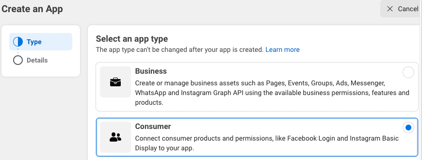
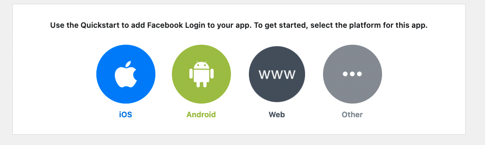
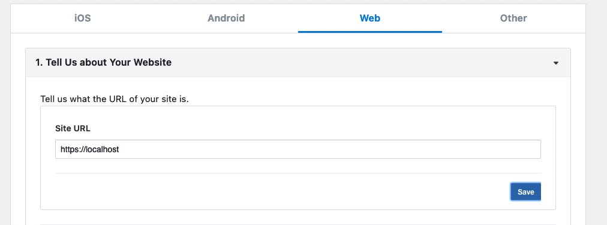
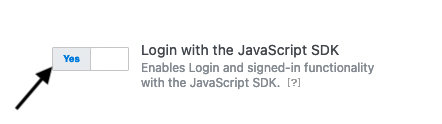
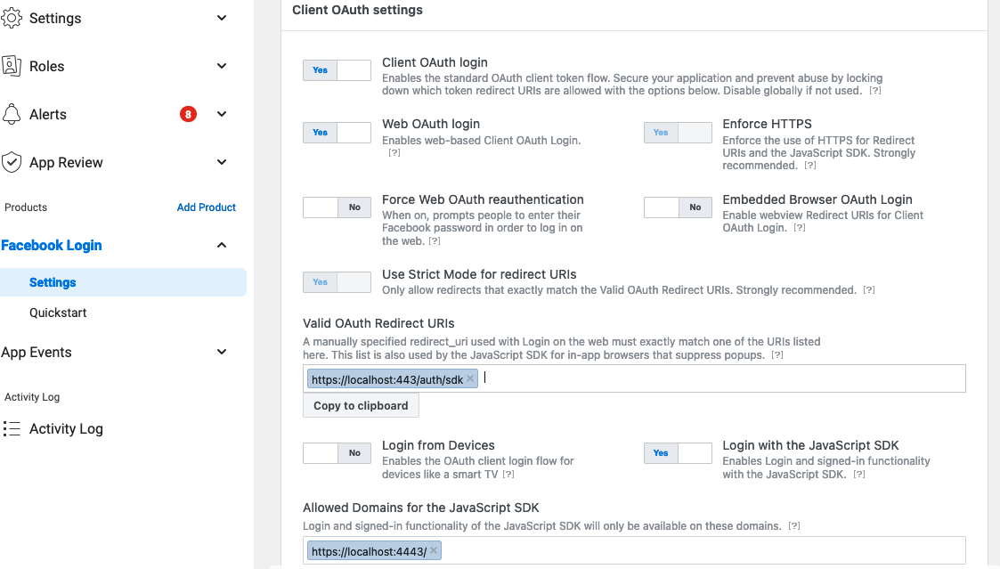
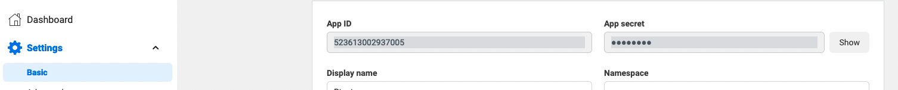
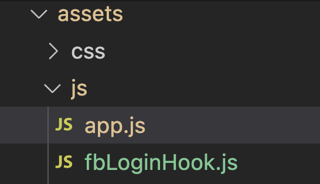

<div align="center">

# `elixir-auth-facebook`

with **`SDK`**


_Easily_ add `Facebook SDK` login to your `Elixir` / `Phoenix` Apps
with step-by-step **_detailed_ documentation**.

</div>

## Why?

Facebook authentication is used **_everywhere_**!
More than tens of millions of people use it everyday.
Facebook Login can be used to authenticate people without planning to access their data.

## What?

❗️ If you target Android or IOS, use the SDK.

It gives you **Facebook `OAuth` Authentication** for your **app** in a few steps with a minimal API.

## How?

These instructions will guide you through setup in a simple steps.
By the end you will have **login with `Facebook`** in your App.

## Step 1: Facebook App Registering 🆕

#### Step 1.1 Create or use a developer account

You firstly need to have a Facebook developer account.
It is free. You get it from your personal Facebook account.

<https://developers.facebook.com/apps/>

#### Step 1.2 Create an App

- select the app type: **"consumer"**
- provide basic info, such as:

  - app name (can be changed)
  - contact name



Once you are done, you arrive to the Dasboard.

Click on **"Facebook Login"**


Select **Web**



##### Define the **site URL**:

❗️ we will use **https**



##### Enable Login with the JavaScript SDK

From the dashboard, navigate to "Facebook Login/Settings"

Turn "Yes"




#### Step 1.3 Your credentials

You will find your **credentials** under "Settings/Basic"



Copy the App ID and the App Secret into your uncommited `.env` file.

```env
# .env
APP_ID=xxxxx
APP_SECRET=xxxx
```

## Step 2: The code: create a Hook

You want to display a **login button** in a template.
This button contains a `phx-hook` to a Javascript file `fbLoginHook`.
There is a listener on the click event to trigger the Facebook dialog.

It will be an external navigation to the Facebook login dialog form.

Once you are connected, we send the users' data to the server with a `POST` request.
We therefor define an endpoint, and a handler in a controller.

#### Add a login link in your template ✨

```html
<button phx-hook="fbLoginHook" id="fbhook" type="button">
  
</button>
<div id="fb-root"></div>
```

The image is located in the "lib" folder.


#### Add the hook `fbLoginHook`

Append to the `hooks` key in the `LiveSocket` constructor, and import the file.

```js
// app.js
import { fbLoginHook } from "./fbLoginhook.js";

let liveSocket = new LiveSocket("/live", Socket, {
  params: { _csrf_token: csrfToken },
  hooks: { fbLoginHook },
              ^^^^
});
```

Copy and place the `fbLoginHook.js` file in your **js** folder.



##### Hard-code the APP_ID

Have a look into the `fbLoginHook.js` file.
Locate the code below and use **your** APP_ID.

```js
window.fbAsyncInit = function () {
  FB.init({
    appId: 366589421180047,   <---- PUT YOURS
    cookie: true,
    xfbml: false,
    version: "v15.0",
  });
```

##### Define a `POST` endpoint in the router 📍

```elixir
# router.ex
pipeline :api do
  plug :accepts, ["json"]

  post "/auth/sdk",
    MyAppWeb.FbSdkAuthController, :handle
end
```

##### Create the controller

```elixir
defmodule MyAppWeb.FbSdkAuthController do
  use LiveMapWeb, :controller
  require Logger

  def handle(conn, params) do
    profile = for {k, v} <- params, into: %{}, do: {String.to_atom(k), v}

    Logger.info(inspect(profile))

    # [... process the profile and render...]
  end
end
```

It eventually sends back an object which identifies the user. 🚀

```elixir
%{
  email: "xxxxx",
  id: "10223726006128074",
  name: "Harry Potter",
  picture: %{
    "data" => %{
      "height" => 50,
      "is_silhouette" => false,
      "url" => "xxxxx",
      "width" => 50
    }
  }
}
```

> ❗️ you received the "Facebook ID" with the key `ID`.

### Notes 📝

All the flow to build the Login flow can be found here:
<https://developers.facebook.com/docs/facebook-login/web>

#### Meta / Privacy Concerns? 🔐

No cookie is set. It just provides a user authentication.

❗️ do you need an [opinion(?) on Meta](https://archive.ph/epKXZ).

Use this functionality as a last resort if you have no other option!
