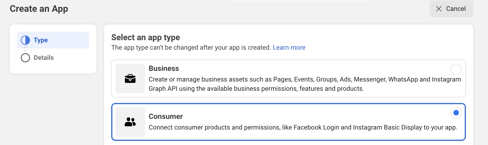

<div align="center">

# `elixir-auth-facebook`


</div>

_Easily_ add `Facebook` login to your `Elixir` / `Phoenix` apps
with step-by-step **_detailed_ documentation**.

## Why?

Facebook authentication is used **_everywhere_**!
Tens of millions of people use it every day.
Facebook Login can be used to authenticate people without planning to access their data.

We wanted to create a reusable `Elixir` package
with beginner-friendly instructions and readable code.

## What?

A simple and easy-to-use `Elixir` package that gives you
**Facebook `OAuth` Authentication** for your **web app**
in a few steps with minimal API.

❗️ If you target Android or IOS, use the SDK.

> If you're new to `Elixir`,
> please see: [dwyl/**learn-elixir**](https://github.com/dwyl/learn-hapi)

## How?

These instructions will guide you through setup in 5 simple steps.
By the end, you will have **login with `Facebook`** in your **Web** App.

> **Note**: if you get stuck,
> please let us know by opening an issue!

## Step 1: Create a Facebook app 🆕

You need to have a Facebook developer account.
It is free. You just use your Facebook account.
You will create an app and get the **credentials** in minutes.

### Step 1.1 Create or use a developer account from your personal Facebook account

Go to <https://developers.facebook.com/apps/>

...after logging in to your Facebook account, you can 'Register Now' for a developer account.

### Step 1.2 Create an App

- select the app type: **"consumer"**
- provide basic info, such as:

  - app name (can be changed)
  - contact name



### Step 1.3 Your credentials

Once you are done, you arrive at the Dasboard.
Select **settings**, then **basic**.


You will find your **credentials** there.
Copy the App ID and the App Secret into your `.env` file.

```env
# .env
export FACEBOOK_APP_ID=xxxxx
export FACEBOOK_APP_SECRET=xxxx
```

### Step 1.4 Specify the base redirect URI

Lastly, you need to set the callback **base URL**.
Your app won't work if a wrong or incomplete base URL is set.

- At the bottom of the form, click on **+ Add platform**


- click on **Web** in the "Select Platform" modal


- a new input will appear: fill the **Site URL** with:
  <http://localhost:4000>


**Note**: this is the base redirect URI, so it has to be an _absolute_ URI, not only the domain. Make sure you include the `http://` prefix.

## Step 2: use the `ElixirAuthFacebook` module

You want to display a **login** link on one of your pages.

### Add a login link in your template ✨

Suppose you have a template "page/index/html" rendered by a controller "PageController".

You can the Facebook Login link in the HTML:

```html.heex
# /lib/app_web/templates/page/index.html.heex

<a class="your-classes" href={@oauth_facebook_url}>
  
</a>
```

### Modify the template controller

The `href` value is `@oauth_facebook_url`.
This is an "assign", a key/value map passed to the `conn` struct.
It is set by using the module `ElixirAuthFacebook`.
In the controller that renders this template, add the code below:

```elixir
# lib/app_web/controllers/page_controller.ex

defmodule AppWeb.PageController do
  use Phoenix.Controller

  def index(conn, _p) do
    oauth_facebook_url =
      ElixirAuthFacebook.generate_oauth_ur(conn)

    render(
      conn,
      "index.html",
      oauth_facebook_url: oauth_facebook_url
    )
  end
end
```

### Create the `/auth/facebook/callback` endpoint 📍

Once the user has filled out the dialogue form, he will be redirected.
Add this line to set the redirection in the router.

```elixir
#AppWeb.Router

scope "/", MyAppWeb do
  pipe_through :browser
  get "/auth/facebook/callback",
    FacebookAuthController, :login
end
```

### Create a `FacebookAuthController`

We finally need a controller to respond to the endpoint:

```elixir
# lib/app_web/controllers/facebook_auth_controller.ex

defmodule AppWeb.FacebookAuthController do
  use Phoenix.Controller

  def login(conn, params) do

    {:ok, profile} =
      ElixirAuthFacebook.handle_callback(
        conn, params
      )

  #[... process the profile for the next render..]
  end
end
```

Facebook will send the user's credentials to the endpoint you created, and the controller/callback will receive them in the `params`.
We use again the `ElixirAuthFacebook` to handle these "params" and deliver the user's identity.

It eventually sends back the object below which identifies the user :eyes:

```elixir
%{
  access_token: "EAAFNaUA6VI8BAPkCCVV6q0U0tf7...",
  email: "xxxxx",
  fb_id: "10223726006128074",
  name: "Harry Potter",
  picture: %{
    "data" => %{
      "height" => 50,
      "is_silhouette" => false,
      "url" => "xxxxx",
      "width" => 50
    }
  }
}
```

A long-term "access_token" is delivered.
The app can interact with the Facebook ecosystem on behalf of the user with the token. These tokens should be saved in the database and appended to a session. If you intend to do so, have a look at the data deletion policy at the end.

> If you simply need to authenticate a user, this token is useless and everything is fine.

### Create a `state` token

This is a secret token you need to generate as a "anti-CSRF" protection.
Type `mix gen.secret 32` In your terminal to generate a token.
Append it to the `FACEBOOK_STATE` key in your `.env` file

```env
# .env
export FACEBOOK_APP_ID=1234...
export FACEBOOK_APP_SECRET=A1B2C3...
export FACEBOOK_STATE= <--- this new token
```

Done! :rocket:

### A note on SSL certificate :lock:

**TL;DR**: if you use this module, you don't need a reverse proxy in DEV mode.

However, if the user denies the login in this mode, then the app stops since it wants to reach an HTTPS endpoint. This is the only limitation.

But if you want to use the SDK, then you need it :hushed:

The SDK wants HTTPS, so you need to **reverse proxy** your app (_and also enable the JSSDK in Facebook's app settings_). This means you have a piece of software between the internet and your app that intercepts the traffic and forwards it back to the app. A reverse proxy can present an SSL certificate to enable the HTTPS protocol.
With this, your app can be reached at https://localhost.
Of course, your app is still running as normal behind, on http://localhost:4000. The port differentiates these modes.

#### How HTTPS :fearful: ?

It's a piece of cake with **[Caddyserver](https://caddyserver.com/docs/)**.
Install it in minutes, create a file named `CaddyFile` at the root, paste the code below in it, and type `caddy run` in a different terminal. That's it :tada:

```
localhost:443 {
	handle {
		reverse_proxy 127.0.0.1:4000
	}
}
```

### Notes 📝

All the flow to build the Login flow can be found here:
<https://developers.facebook.com/docs/facebook-login/guides/advanced/manual-flow>

### Meta

#### Privacy Concerns? 🔐

No cookie is set. It just provides user authentication.

You have the tokens to do more,❗️ but need an [opinion(?) on Meta](https://archive.ph/epKXZ).
Use this package as a last resort if you have no other option!

#### Data deletion?

If you want to use the package to access Metas' ecosystem, then you need to provide [a data deletion option](https://developers.facebook.com/docs/facebook-login/overview)

❗️ To be compliant with GDPR guidelines, you must provide the following:

- A way in your app for users to request their data be deleted
- A contact email address that people can use to reach you to request their data be deleted
- An implementation of the data deletion callback
